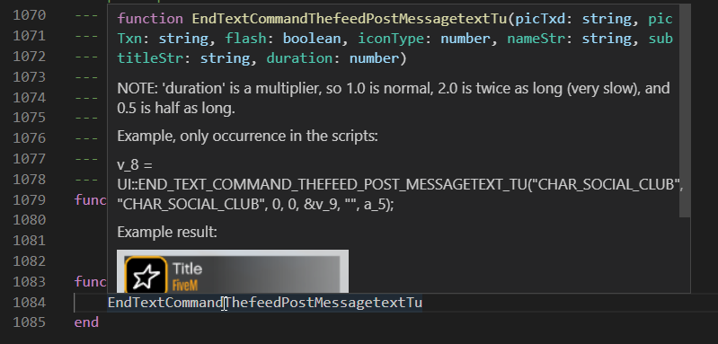

# FiveM Lua Stubs


This repo contains Lua stubs which can be used by [sumneko's Lua language server for VSCode](https://marketplace.visualstudio.com/items?itemName=sumneko.lua).

## Updating
When updating the stubs, make sure you're using Python 3 and have `requests` installed.

## Downloading
Download the latest release from GitHub releases

## How to use?
These docs are only for Visual Studio Code and sumneko's Lua language server, for other editors/servers your mileage may vary.

### How to add the stubs globally
- Open Visual Studio Code
- Click View -> Extensions or (<kbd>Ctrl</kbd> + <kbd>Shift</kbd> + <kbd>X</kbd>)
- Lua -> Cogwheel (Bottom Right) -> Extension Settings
- Scroll down until you see "Lua › Workspace: Library"
- Click `Edit in settings.json`
- Add the following within the braces:
```json
"Lua.workspace.library": {
    "C:/fivemstubs": true,
},
```
Where `C:/fivemstubs` is the path to the stubs on your disk.

### How to add the stubs to your workspace
- Open the workspace for your project you want to add the stubs too
- Press <kbd>Ctrl</kbd> + <kbd>Shift</kbd> + <kbd>P</kbd>
- Type in `open worksp` and press enter on the `Open Workspace Setting (JSON)`
- Add the following within the braces:
```json
"Lua.workspace.library": {
    "C:/fivemstubs": true,
},
```

### Additional Tip
If you're using FiveM's FXServer you should add the following path to the libraries list: `C:/server/citizen/scripting/lua` where `server` is the folder which contains `FXServer.exe`

## Support
Support will be given for the stub generator, missing or unexpected behaviour from the stubs but not for anything else.